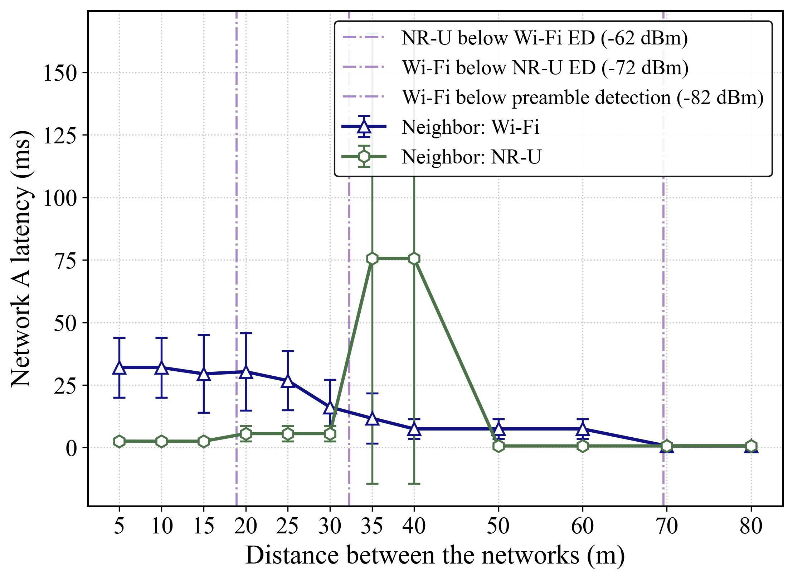
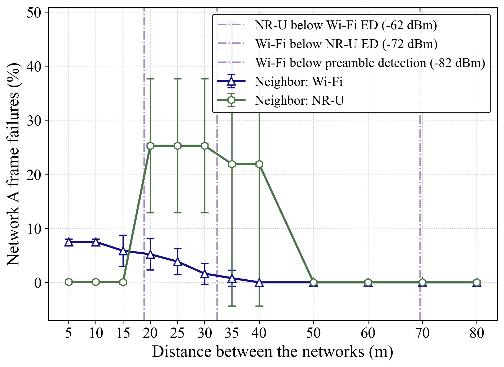
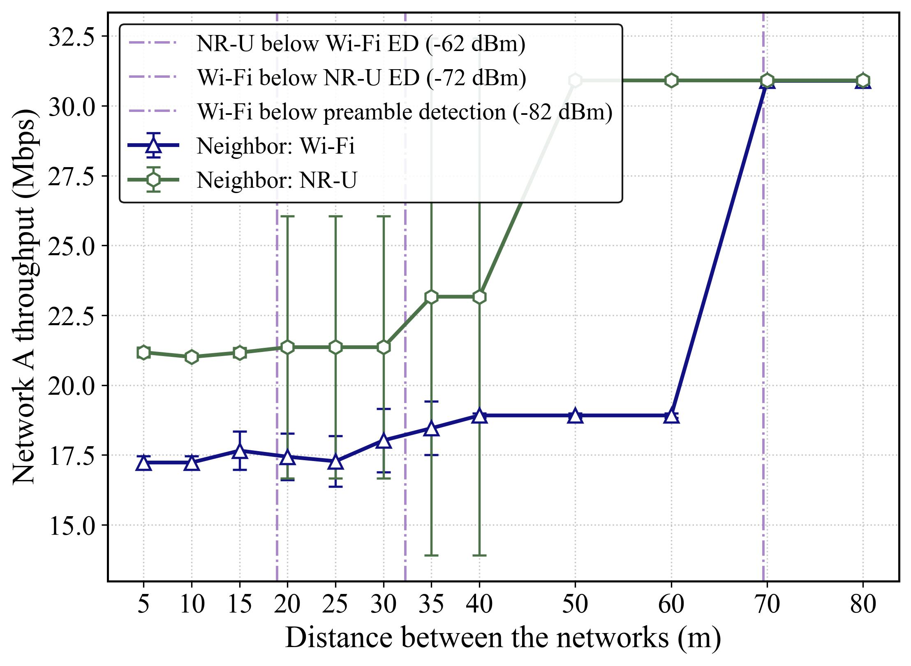
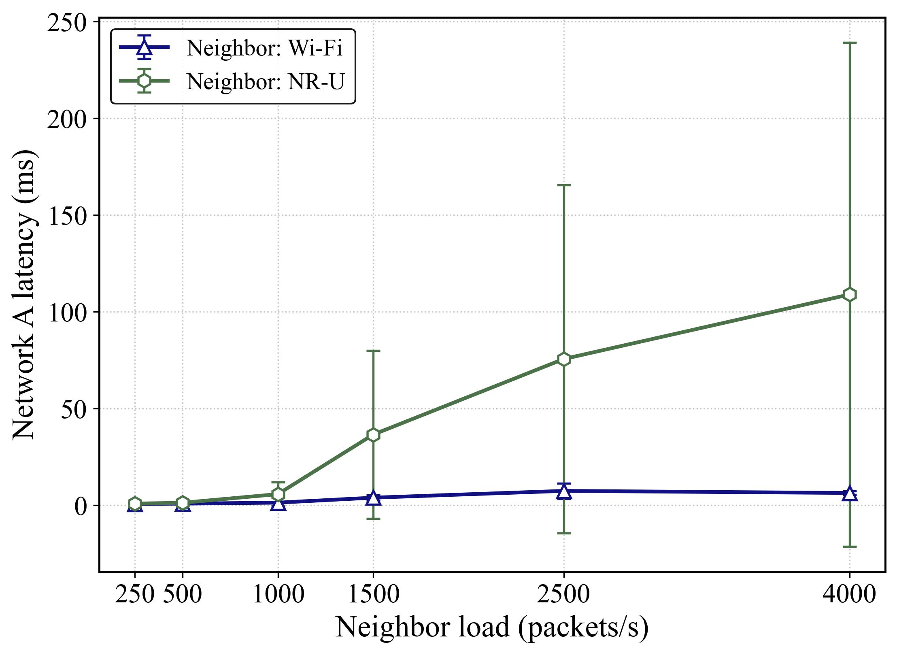
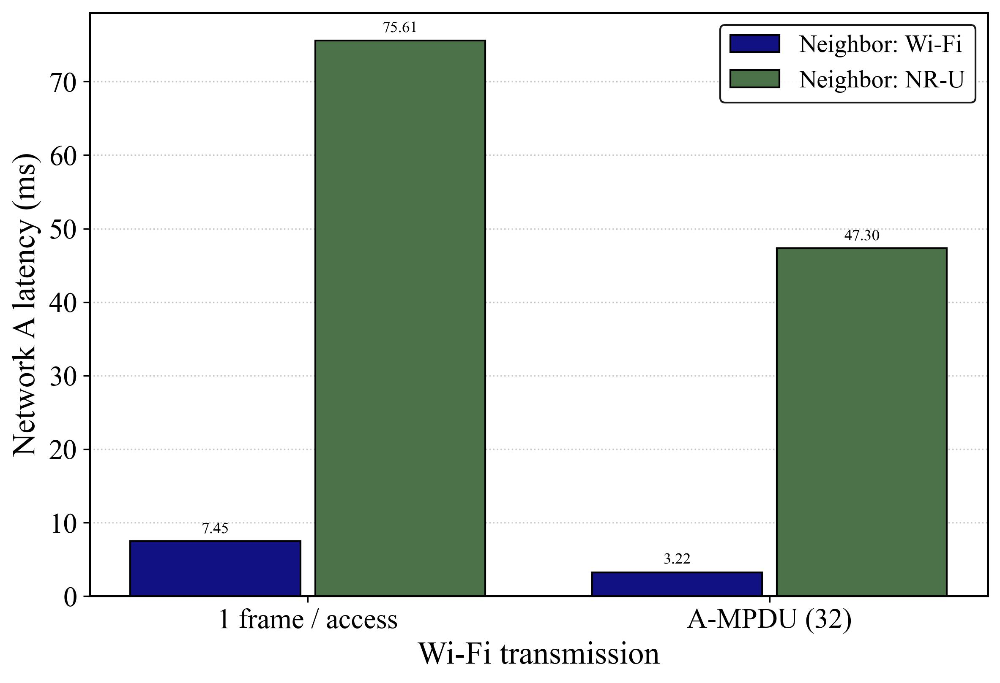
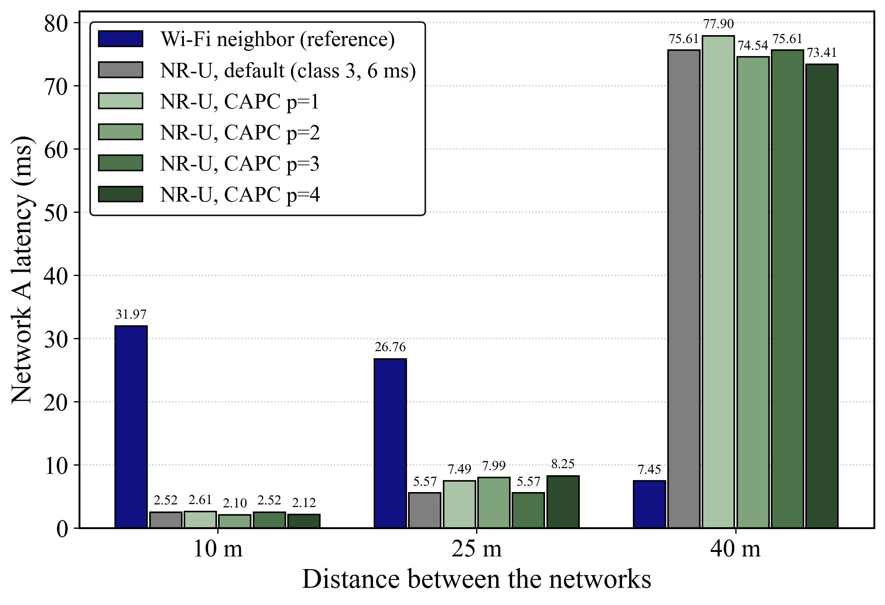
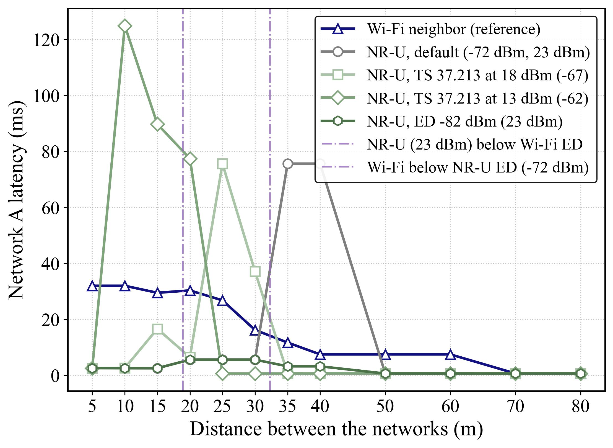
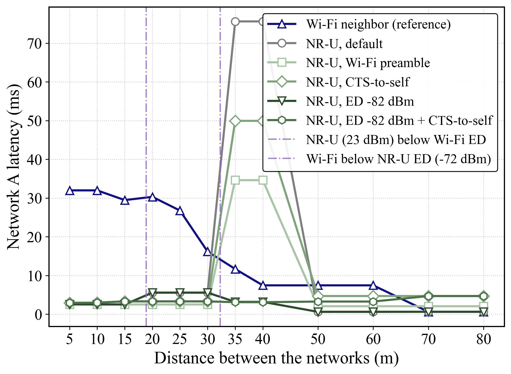
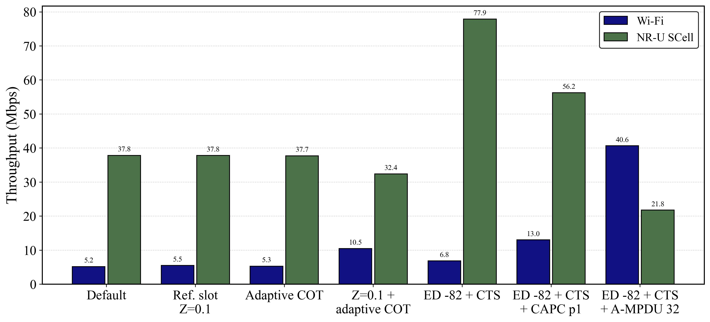

# LAA / NR-U fairness study (Step pre_20)

## 1. The question

Step 19.F added NR-U as a secondary cell (SCell) for a licensed 5G cell
(LAA-style carrier aggregation). In that scenario, a neighboring Wi-Fi
AP dropped from **30.3 to 2.8 Mbps** when the SCell was switched on. This
study asks three things:

- Is that unfair by the standard 3GPP definition?
- Where does the unfairness come from?
- Which of the mitigations people propose actually fix it?

## 2. Method

**Fairness definition: the 3GPP replacement test** (TR 38.889 §7.2.1,
TR 36.889 §8.2). NR-U must not hurt a Wi-Fi network more than another
Wi-Fi network carrying the same load would.

Every point compares two runs with the same seeds:

| | Network A (the victim) | Neighbor B |
|---|---|---|
| Run 1 | Wi-Fi AP at (0, 0), STAs within 5 m | a second Wi-Fi AP at (d, 0) |
| Run 2 | same | an NR-U gNB at (d, 0) (`--nru-cot-model slots`) |

- **Loads:** A = 1500 pkt/s (about 18 Mbps), B = 2500 pkt/s (about 29 Mbps), Poisson, 1472-byte packets.
- **Statistics:** 5 seeds of 1 s each, 95% confidence intervals.
- **Wi-Fi carrier sense:** 802.11 preamble detection is on (`--wifi-preamble-detect`). Wi-Fi defers to Wi-Fi frames from −82 dBm and to anything else from −62 dBm. Without it, a second Wi-Fi network would be as invisible as NR-U, and the baseline would be wrong.
- **Pass criterion, used to score mitigations:** network A's mean latency next to NR-U is at most 1.1 × its latency next to Wi-Fi, plus the confidence interval.

Airtime share and Jain's index are reported too (`--fairness-report`),
but they mislead. In the 19.F case, Jain's index over airtime is 0.91
with the SCell on, because Wi-Fi still occupies 45% of the airtime. Only
5.7% of that airtime succeeds.

**Radio model:**
- path loss: log-distance, exponent 3, free-space loss at 1 m, 5.18 GHz, no shadowing;
- transmit power: NR-U 23 dBm, Wi-Fi 20 dBm;
- NR-U energy detection: −72 dBm.

Because there is no shadowing, results change in steps between the
crossover distances below rather than smoothly.

| Distance | What changes |
|---|---|
| 18.9 m | NR-U drops below Wi-Fi's −62 dBm energy detection |
| 32.3 m | Wi-Fi drops below NR-U's −72 dBm energy detection |
| 69.6 m | Wi-Fi drops below Wi-Fi's −82 dBm preamble detection |

## 3. Diagnosis (pre_20.C)

`python -m analysis.laa_fairness_sweeps`



Network A's latency, and its frame failures in brackets:

| Distance | Neighbor Wi-Fi | Neighbor NR-U | Regime |
|---|---|---|---|
| 5–15 m | 30–32 ms (6–7%) | 2.5 ms (0.1%) | Both sides hear each other. NR-U **passes**: its 6 ms COTs are more efficient than a second Wi-Fi network, and the Wi-Fi pair is overloaded. |
| 20–30 m | 16–30 ms (2–5%) | 5.6 ms (25%) | One-sided: NR-U hears Wi-Fi, Wi-Fi doesn't hear NR-U. A quarter of Wi-Fi's frames are hit, but NR-U still waits for ongoing Wi-Fi frames, so latency passes. |
| **35–40 m** | **7.5–12 ms (0–1%)** | **75.6 ms (22%)** | **Neither side hears the other by energy detection**, but NR-U is still strong enough to break Wi-Fi frames. NR-U **fails** by 6–10×. |
| 50–60 m | 7.5 ms | 0.6 ms | NR-U is too weak to break Wi-Fi's MCS. The Wi-Fi pair still shares the channel through preamble detection. |
| 70–80 m | 0.6 ms | 0.6 ms | Independent. |



- **The worst case is not the one-sided energy-detection gap.** It is the band where neither side senses the other while NR-U still interferes. A Wi-Fi neighbor at the same distance is still heard, through its preamble.
- **Throughput hides the problem.** A saturated network A gets 21–23 Mbps next to NR-U, against 17–19 Mbps next to Wi-Fi, even at 35–40 m, because retries get packets through. Only latency and frame failures show the harm.



**Load.** At 40 m, NR-U fails the test from about 1000 pkt/s (5.8 vs 1.4
ms). At 4000 pkt/s, A's latency is 109 ms with 26% frame failures,
against about 6 ms next to Wi-Fi.



**Aggregation (pre_20.B).** Wi-Fi A-MPDU (`--wifi-ampdu 32`) cuts A's
latency at 40 m from 75.6 to 47.3 ms next to NR-U, against 7.5 → 3.2 ms
next to Wi-Fi. The gap is still about 15×. In the 19.F LAA scenario
aggregation makes things worse: Wi-Fi gets 0.64 Mbps, because a 5.4 ms
PPDU that can't hear NR-U almost always overlaps a COT.



## 4. Mitigations (pre_20.D)

The replacement-test scoring is in
`python -m analysis.laa_fairness_mitigations [capc|ed|ed_distance|reservation]`.
The 19.F LAA scenario is scored by `python -m analysis.laa_scell_mitigations`.

### D.1 TS 37.213 channel access priority classes (`--nru-priority-class 1-4`)

| Class | m_p | CW_min | CW_max | MCOT (downlink) |
|---|---|---|---|---|
| 1 | 1 | 3 | 7 | 2 ms |
| 2 | 1 | 7 | 15 | 3 ms |
| 3 | 3 | 15 | 63 | 8 ms |
| 4 | 7 | 15 | 1023 | 8 ms |

The table above is TS 37.213 Table 4.1.1-1. UEs running their own
Type 1 LBT use Table 4.2.1-1.

**Result: no class fixes 40 m** (73–78 ms against 7.5 ms). The problem
is sensing, not contention parameters. At this load the COTs average
about 0.5 ms, so the MCOT never binds.



### D.2 Energy-detection threshold (`--nru-ed-mode ts37213`, `--nru-ed-threshold-dbm`)

TS 37.213 §4.1.5, for the case where another technology may share the
carrier:

X = max{−72 + 10·log10(BW/20), min{T_max, T_max − T_A + (P_H + 10·log10(BW/20) − P_TX)}}

At 20 MHz and 23 dBm this gives −72 dBm, the default. Lower transmit
power raises the threshold (18 dBm → −67, 13 dBm → −62). The max{}
means it never goes below −72.

**Results:**
- **The standard rule only moves the blind band.** At 18 dBm, NR-U fails at 25–30 m; at 13 dBm, at 10–20 m (up to 125 ms), and NR-U also loses throughput.
- **A non-standard −77 or −82 dBm threshold passes at every distance**, because NR-U now waits for Wi-Fi. But 13–25% of Wi-Fi's frames still fail: Wi-Fi still can't hear NR-U.



### D.3 Making COTs visible to Wi-Fi (`--nru-wifi-reservation preamble|cts_to_self`)

- **`preamble`:** NR-U transmissions carry an 802.11-decodable preamble, so Wi-Fi defers from −82 dBm. This has no airtime cost and is an upper bound.
- **`cts_to_self`:** before each COT, the gNB sends an 802.11 CTS-to-self (44 µs plus 16 µs SIFS, inside the MCOT). Its NAV covers the whole COT.

**Results:**
- **Either mode removes Wi-Fi's failures in the one-sided band (20–30 m).** They don't fix 35–40 m, where NR-U can't hear Wi-Fi either.
- **D.2 plus D.3 (ED −82 dBm + CTS-to-self) passes at every distance up to 60 m**, with about 0.03% Wi-Fi failures and about 3 ms latency.
- **At 70–80 m the 23 dBm CTS over-protects.** It can be decoded out to about 88 m, past a 20 dBm Wi-Fi neighbor's ~70 m, so Wi-Fi waits for COTs that couldn't hurt it (4.7 vs 0.6 ms).



### D.4 Reference-slot feedback (`--nru-ref-nack-threshold`, `--nru-adaptive-cot`)

This makes the contention window grow on any loss (smaller NACK
threshold Z), and halves the COT length after a failed reference slot.

**Result: it is blind to the harm NR-U causes.** In the replacement test,
NR-U's reference slots fail 0% of the time at 25 and 40 m, while Wi-Fi
fails 31–36%. NR-U's UEs are close to the gNB, where Wi-Fi is weak.
Results are unchanged.

In the LAA scenario NR-U does see losses, and D.4 simply moves throughput
from NR-U to Wi-Fi:

| 19.F LAA scenario | Wi-Fi | NR-U SCell |
|---|---|---|
| Default | 5.2 Mbps | 37.8 Mbps |
| Z = 0.1 + adaptive COT (D.4) | 10.5 | 32.4 |
| ED −82 + CTS-to-self (D.2 + D.3) | 6.8 | **77.9** |
| ED −82 + CTS + class 1 | **13.0** | 56.2 |
| ED −82 + CTS + Wi-Fi A-MPDU 32 | 40.6 | 21.8 |

Wi-Fi alone gets 30.8 Mbps. Next to a saturated Wi-Fi neighbor it would get about half.



## 5. Conclusions

1. **The unfairness is a sensing problem.** It is not a contention-parameter or feedback problem. Energy detection at −62 dBm (Wi-Fi) and −72 dBm (NR-U) leaves a band, about 32–45 m here, where each side transmits over the other.
2. **Both sides need fixing.** NR-U needs a lower threshold to hear Wi-Fi (non-standard: TS 37.213 floors at −72 dBm). Wi-Fi needs something it can decode (CTS-to-self or a preamble). Together they pass the replacement test everywhere the networks interact. Each alone leaves 9–25% Wi-Fi frame failures somewhere.
3. **Standard knobs don't get there.** Priority classes, the 37.213 power/threshold trade-off, and reference-slot feedback either do nothing or just move throughput from one side to the other.
4. **After the sensing fix, what's left is airtime per channel access.** A ~0.25 ms Wi-Fi frame competes with a 6 ms COT. Class 1 (2 ms MCOT) gives the most even split in the LAA scenario. With Wi-Fi A-MPDU the balance flips to Wi-Fi: NR-U then loses in its sync-slot gap, because after its backoff it waits for the next slot boundary and Wi-Fi takes the channel in between. That gap is an NR-U disadvantage of its own, and worth a follow-up (reservation signal vs gap).

## 6. Simulator bug found along the way (pre_20.D.3a)

Under the full-power SINR rule for Wi-Fi frames (pre_18.A), interferers
were summed per transmission. So a Wi-Fi frame overlapping two
consecutive transmissions from the same node counted that node twice
(+3 dB); the two transmissions could be a CTS and its COT, or two
back-to-back NR-U COTs.

It is now counted at the node's peak instantaneous power. This changed
one of the 14 regression cases (2 gNBs: Wi-Fi collision probability
0.421 → 0.381). Every study result above was re-run with the fix and is
unchanged.

## 7. Limitations

- **No shadowing or fading.** The regimes are sharp steps. Real deployments would blur the band boundaries.
- **One topology:** one AP, one neighbor, STAs and UEs within 5 m, 20 MHz on a single channel, 802.11a rates.
- **The NAV is optimistic.** Every Wi-Fi node in decoding range honors it, including one that was transmitting when the CTS went out. The preamble mode is an upper bound in the same way.
- **The replacement test uses unsaturated loads** (except the throughput sweep). The pass criterion is latency-based.
- **A-MPDU** is 802.11n-style aggregation on the legacy 20 MHz rate table, for the AP downlink only.

## 8. Reproduce

```bash
python -m analysis.laa_fairness              # baseline replacement test (pre_20.A)
python -m analysis.laa_fairness_sweeps       # distance / load / A-MPDU sweeps (~8 min)
python -m analysis.laa_fairness_mitigations  # D.1-D.3 scoring (~20 min; or name one study: capc, ed, ed_distance, reservation)
python -m analysis.laa_scell_mitigations     # 19.F LAA scenario (~3 min; --plot-only redraws)
```

CSVs land in `analysis/generated/` (untracked). Figures are written there
as PDF and JPG.
